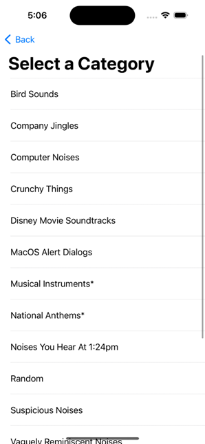
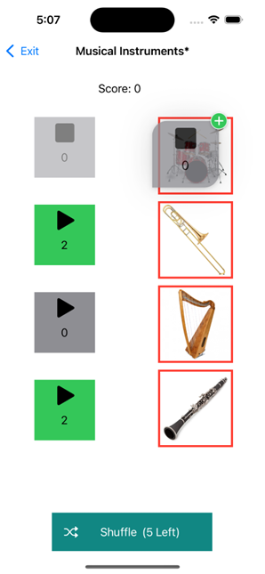

# Soundboard Quiz

Categories View            |  Gameplay View
:-------------------------:|:-------------------------:
  |  

A simple quiz game developed entirely in Swift for iOS, using Apple-native frameworks such as core data, visual-impaired accessibility, and stock views. (Ab)uses infinite table layouts for in-game progression scroll animations!
See the [formal specifications document](https://github.com/lukeaschenbrenner/SoundboardQuiz/raw/main/Formal%20Specifications.docx) for more details.
